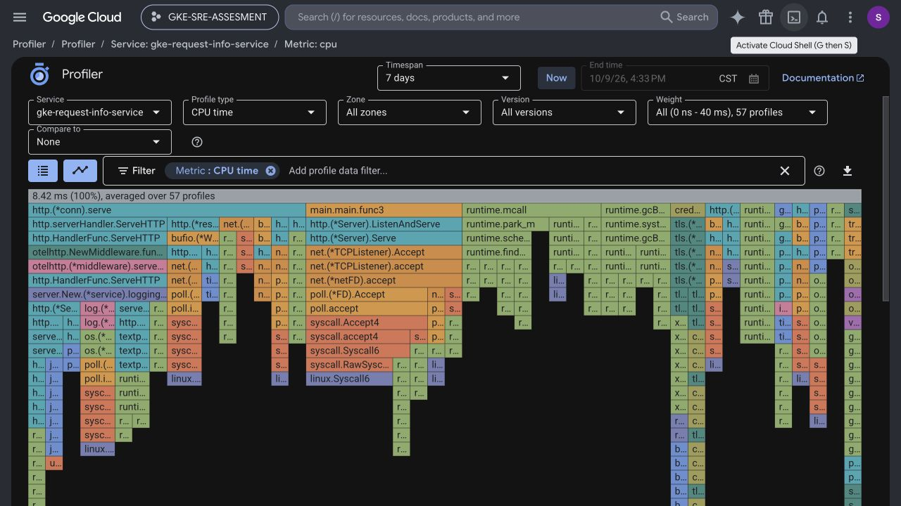
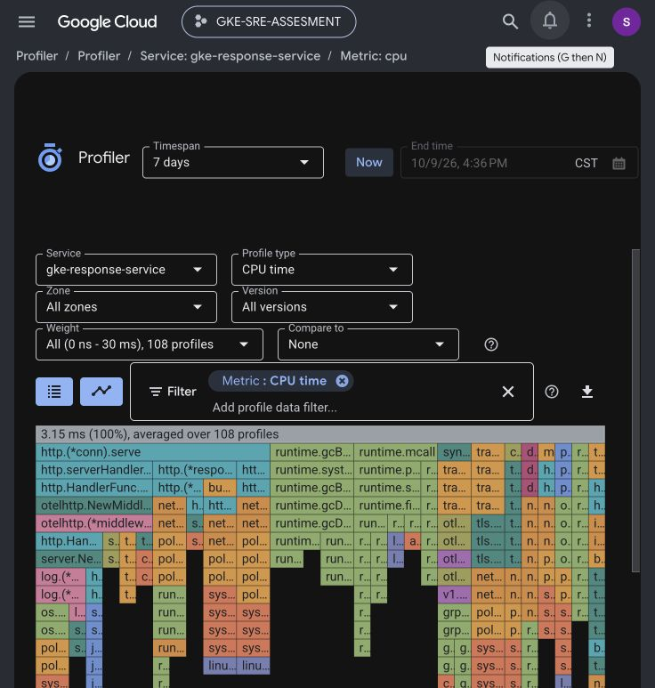
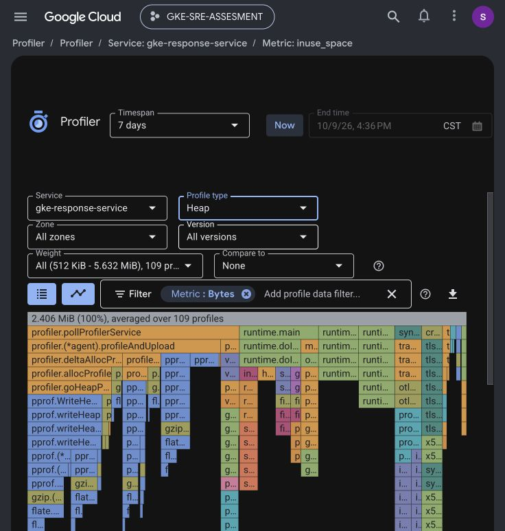

# Cloud Profiler Evidence

**Verified:** October 9, 2026 (America/Chicago)

**GCP project:** `gke-sre-assesment`

**Observation window:** Seven days ending at verification time

## Result

Cloud Profiler contains live profiles from both assessment applications. The
service selector identified each application independently, and the flame
graphs contained application, HTTP, OpenTelemetry, Go runtime, and system call
stacks. This confirms that the profiler agents started successfully and
uploaded profiles through their keyless GKE workload identities.

| Service | Profile type | Profiles observed | Observed weight |
| --- | --- | ---: | --- |
| `gke-request-info-service` | CPU time | 57 | 0 ns–40 ms |
| `gke-response-service` | CPU time | 108 | 0 ns–30 ms |
| `gke-response-service` | Heap | 109 | 512 KiB–5.632 MiB |

The response-service heap view averaged 2.406 MiB over 109 profiles. The
Profiler UI also offered allocated-heap and thread profiles. CPU and live heap
evidence therefore cover both processor and memory profiling required by the
assessment.

## Request-service CPU profile

The screenshot shows `gke-request-info-service`, CPU time, all zones and
versions, and 57 profiles. The captured graph averaged 8.42 ms over those
profiles.

## Response-service CPU profile

The screenshot shows `gke-response-service`, CPU time, all zones and versions,
and 108 profiles. The captured graph averaged 3.15 ms over those profiles.

## Response-service heap profile

The screenshot shows the same live response service using the heap profile
type. The weight range and byte-based flame graph distinguish it from the CPU
profile.

## Identity and security

The applications receive only `roles/cloudprofiler.agent` and
`roles/cloudtrace.agent` through GKE Workload Identity principals. No static
service-account key is used. Profile data contains stack and resource behavior;
it does not require reading the Secret Manager payload demonstrated by the
response service.

## Requirement closure

Together with the verified Error Reporting group and the primary and secondary
three-span traces, these live profiles complete the assessment's Cloud Trace,
Cloud Profiler, and Error Reporting evidence group.
