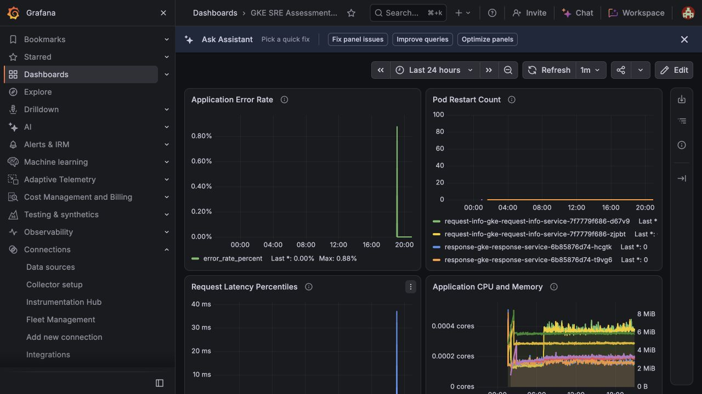

# Grafana Dashboard Evidence

## Result

The required cloud-hosted Grafana dashboard was verified on October 8, 2026
using real data from the primary GKE deployment. All four required panels
rendered successfully after dashboard JSON from merged platform PRs #18 and
#19 was imported.

## Verified panels

| Panel | Data source | Observed result |
| --- | --- | --- |
| Application Error Rate | BigQuery | Request completion series rendered; the 24-hour maximum was `0.88%` and the latest value was `0.00%` |
| Pod Restart Count | Google Cloud Monitoring | Request and response workload pods rendered with a latest restart count of `0` |
| Request Latency Percentiles | BigQuery | p50, p95, and p99 series rendered; the visible p99 maximum was `37 ms` |
| Application CPU and Memory | Google Cloud Monitoring | Per-pod CPU and memory series rendered with separate core and byte axes |

These are controlled assessment observations, not production SLO baselines.
The 24-hour view also includes superseded response pods from prior rollouts,
which is expected for historical metrics.

## Implementation verification

- Dashboard UID: `gke-sre-assessment`
- Dashboard title: `GKE SRE Assessment Observability`
- BigQuery project: `gke-sre-assesment`
- BigQuery dataset: `assessment_app_logs`
- GKE cluster: `gke-primary`
- Kubernetes namespace: `assessment-apps`
- Dashboard source:
  [`grafana/dashboards/gke-sre-assessment.json`](../../grafana/dashboards/gke-sre-assessment.json)
- Dashboard runbook: [Grafana assessment dashboard](../grafana-dashboard.md)

The BigQuery panels read request-service completion logs only, preventing the
same end-to-end request from being counted once by each application. The
Cloud Monitoring panels use PromQL and group the GKE container metrics by pod.

## Remaining credential cleanup

The dashboard evidence is now captured. After this evidence PR is merged:

1. Revoke the temporary Google service-account key used by the Grafana data
   sources.
2. Delete the temporary local JSON key file.
3. Revoke the unused Grafana Kubernetes-onboarding access-policy token.

The Grafana data sources will stop refreshing after the temporary Google key
is revoked. That is acceptable after evidence capture unless continued live
dashboard access is required; a long-lived deployment should use a keyless
identity mechanism instead.
